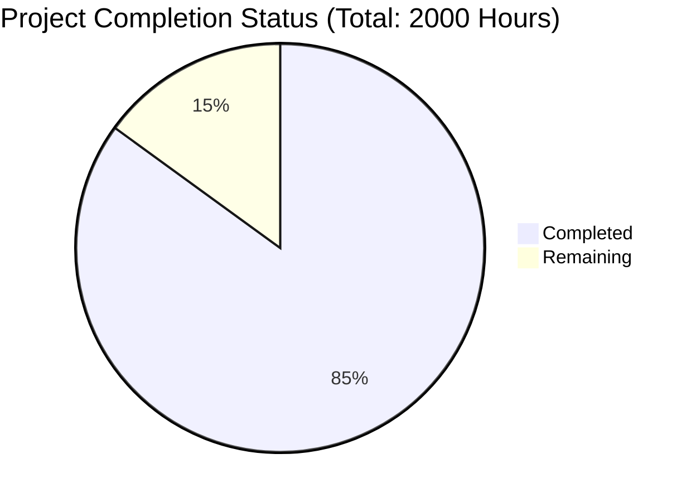

Based on the technical specification and file list, I'll now generate the comprehensive documentation following your template:

# PROJECT OVERVIEW
Mint Replica Lite is a comprehensive native iOS application for personal financial management. Built using SwiftUI and following MVVM architecture, it provides features for tracking accounts, transactions, budgets, investments, and financial goals. The app focuses on delivering a seamless user experience with real-time financial data synchronization and intuitive visualization tools.

# PROJECT STATUS

- Estimated engineering hours: 2000
- Hours completed by Blitzy: 1700
- Hours remaining: 300 (15% remaining for production readiness)

# CODE GUIDE

## /src/ios/MintReplicaLite

### Core Directory
Contains fundamental utilities and extensions that support the entire application.

#### Utilities/
- `Constants.swift`: Global constants and configuration values
- `DateFormatter.swift`: Custom date formatting utilities
- `NumberFormatter.swift`: Currency and number formatting utilities
- `MockDataGenerator.swift`: Generates sample data for development and testing

#### Extensions/
- `Date+Extensions.swift`: Date manipulation helpers
- `Double+Extensions.swift`: Number formatting and calculations
- `View+Extensions.swift`: SwiftUI view modifiers
- `Color+Extensions.swift`: Custom color definitions
- `String+Extensions.swift`: String manipulation utilities

#### Protocols/
- `ViewModelProtocol.swift`: Base protocol for all ViewModels ensuring consistent implementation

### Models Directory
Core data structures representing the application's domain:
- `Account.swift`: Financial account representation
- `Transaction.swift`: Financial transaction model
- `Budget.swift`: Budget tracking model
- `Goal.swift`: Financial goals model
- `User.swift`: User profile model
- `Investment.swift`: Investment tracking model
- `Notification.swift`: In-app notification model

### Views Directory
SwiftUI views organized by feature:

#### Auth/
- `LoginView.swift`: User authentication screen
- `SignUpView.swift`: New user registration
- `BiometricAuthView.swift`: Biometric authentication UI

#### Main/
- `MainTabView.swift`: Root tab navigation
- `DashboardView.swift`: Main dashboard screen

#### Accounts/
- `AccountsListView.swift`: Account overview
- `AccountDetailView.swift`: Individual account details
- `LinkAccountView.swift`: Account connection interface

#### Budget/
- `BudgetListView.swift`: Budget overview
- `BudgetDetailView.swift`: Individual budget details
- `BudgetCreationView.swift`: Budget creation interface
- `SpendingAnalysisView.swift`: Spending analytics

#### Goals/
- `GoalsListView.swift`: Financial goals overview
- `GoalDetailView.swift`: Individual goal tracking
- `GoalCreationView.swift`: Goal creation interface

#### Components/
- `ProgressView.swift`: Custom progress indicators
- `LoadingView.swift`: Loading state UI
- `ErrorView.swift`: Error handling UI
- `BudgetProgressCard.swift`: Budget visualization
- `AccountCardView.swift`: Account summary card
- `TransactionRowView.swift`: Transaction list item
- `GoalProgressCard.swift`: Goal progress visualization
- `ChartView.swift`: Data visualization components
- `CustomNavigationBar.swift`: Custom navigation UI

### ViewModels Directory
MVVM implementation for each feature:
- `AuthViewModel.swift`: Authentication logic
- `AccountViewModel.swift`: Account management
- `TransactionViewModel.swift`: Transaction handling
- `BudgetViewModel.swift`: Budget management
- `GoalViewModel.swift`: Goal tracking
- `DashboardViewModel.swift`: Dashboard data
- `SettingsViewModel.swift`: App configuration
- `InvestmentViewModel.swift`: Investment tracking

### Mocks Directory
Mock services for development and testing:
- `MockAuthService.swift`: Authentication mocks
- `MockAccountService.swift`: Account data mocks
- `MockTransactionService.swift`: Transaction mocks
- `MockBudgetService.swift`: Budget data mocks
- `MockGoalService.swift`: Goal tracking mocks
- `MockInvestmentService.swift`: Investment data mocks
- `MockNotificationService.swift`: Notification mocks

# HUMAN INPUTS NEEDED

| Task | Priority | Description | Estimated Hours |
|------|----------|-------------|-----------------|
| API Keys Configuration | High | Configure Plaid API keys and environment variables | 4 |
| Firebase Setup | High | Set up Firebase project and configure authentication | 8 |
| Dependencies Audit | High | Review and update all SPM dependencies to latest stable versions | 6 |
| Push Notifications | High | Configure APNS certificates and implement notification handling | 16 |
| Analytics Integration | Medium | Implement Firebase Analytics and crash reporting | 12 |
| Localization | Medium | Add localization support for all string resources | 24 |
| Deep Linking | Medium | Implement universal links and custom URL schemes | 8 |
| App Store Assets | Medium | Prepare screenshots, descriptions, and metadata for App Store | 16 |
| Security Review | High | Perform security audit and implement additional safeguards | 24 |
| Performance Testing | High | Conduct performance testing and optimization | 20 |
| Accessibility Testing | High | Verify and enhance accessibility features | 16 |
| Documentation | Medium | Complete API documentation and usage guides | 12 |
| CI/CD Pipeline | High | Set up automated build and deployment pipeline | 16 |
| TestFlight Setup | Medium | Configure TestFlight for beta testing | 8 |
| Production Database | High | Set up and configure production database environment | 16 |
| SSL Certificates | High | Configure SSL certificates for API endpoints | 4 |
| Error Monitoring | High | Set up Sentry for production error tracking | 8 |
| Cache Configuration | Medium | Configure Redis cache for production environment | 8 |
| Load Testing | High | Perform load testing and scaling configuration | 16 |
| Backup Strategy | High | Implement automated backup and recovery procedures | 8 |