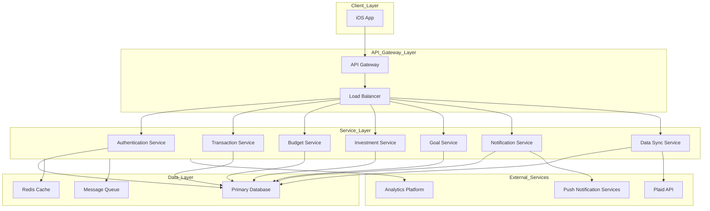
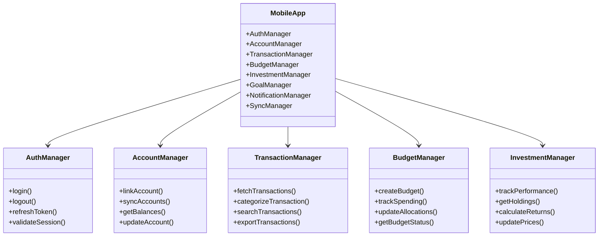
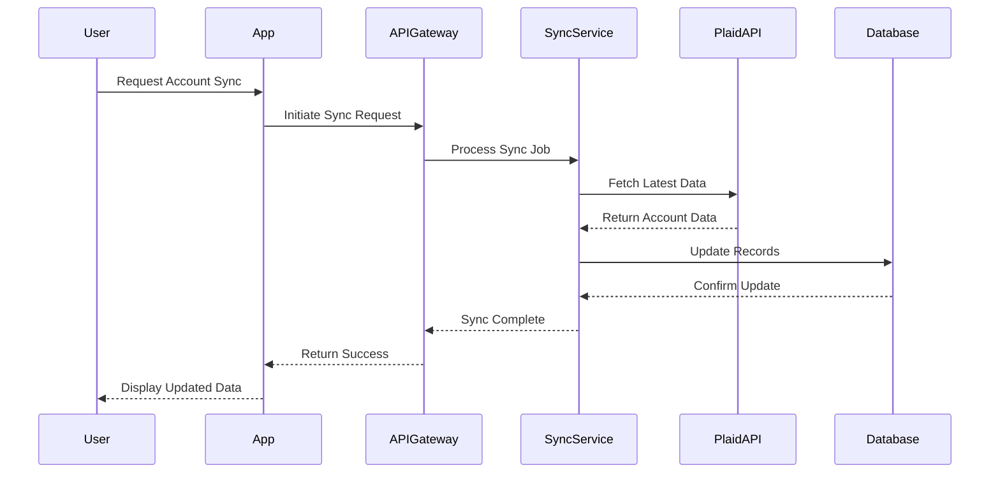
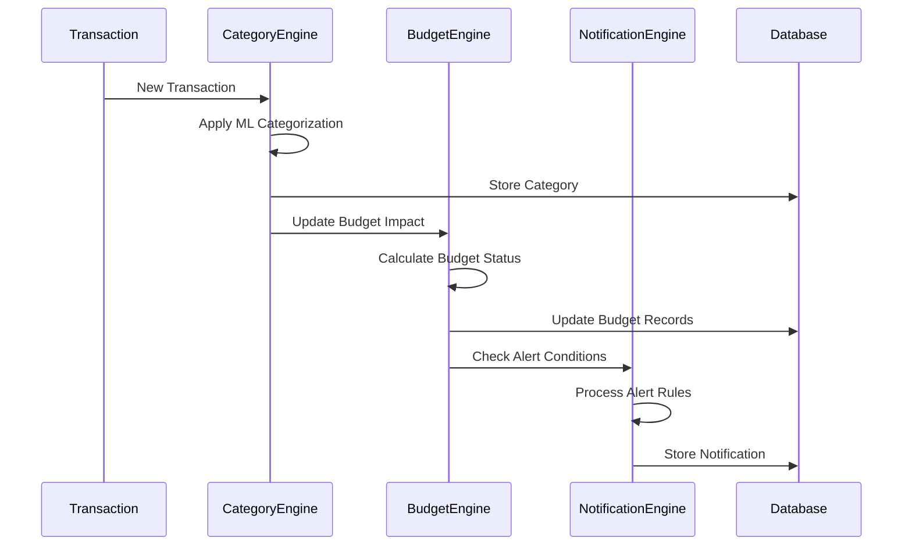
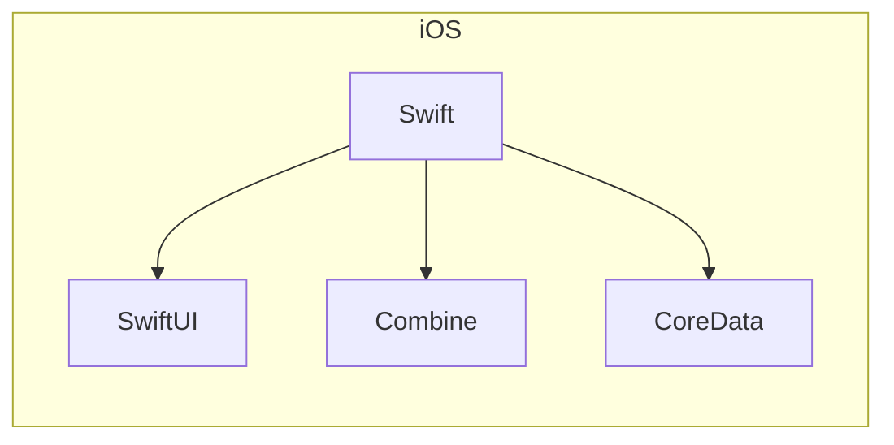
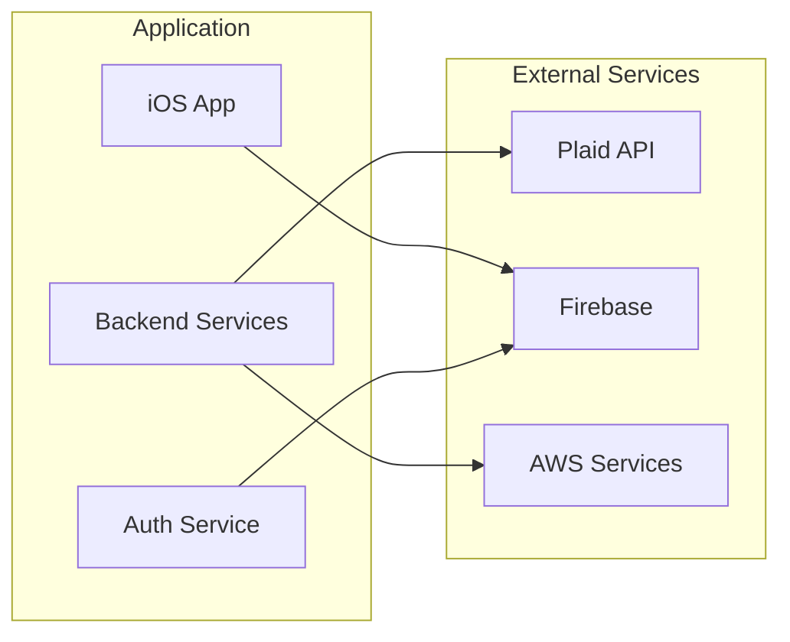
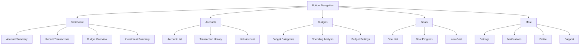
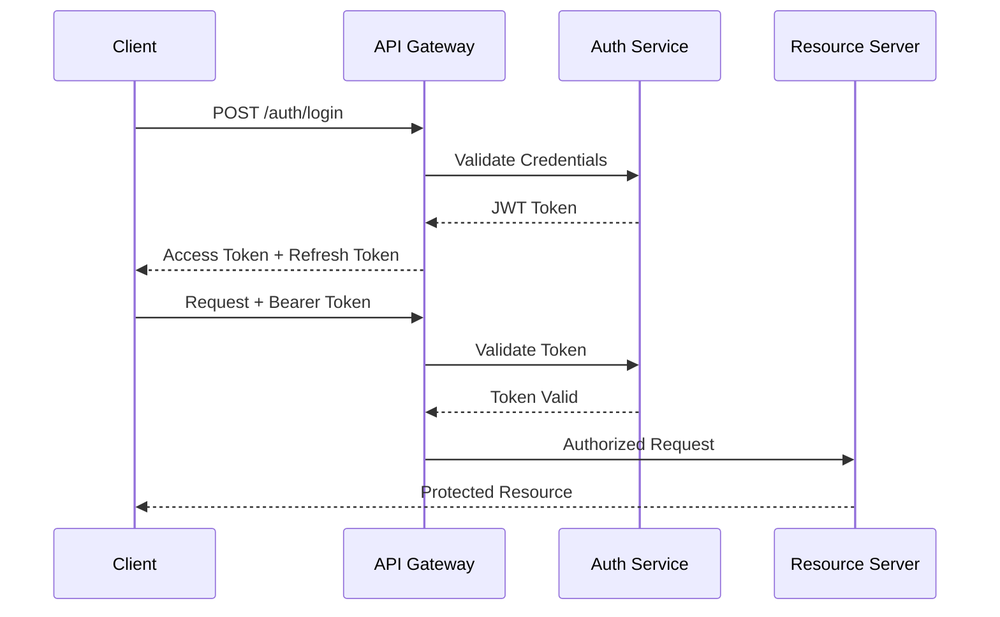

# Mint Replica

# 1. Introduction

## 1.1 System Overview

Mint Replica Lite is a comprehensive native iOS app that functions as a personal financial management system 

## 1.2 Scope

The Mint Replica Lite system encompasses:

### Core Features

- Secure user authentication and account management
- Financial institution integration and account aggregation
- Transaction tracking and categorization
- Budget creation and monitoring
- Basic investment portfolio tracking
- Financial goal setting and progress monitoring
- Real-time notifications and alerts
- Data export and reporting capabilities

### Technical Implementation

- iOS mobile application using native development frameworks

### Boundaries

The system explicitly excludes:

- Web or Backend services
- Android apps
- Unit tests
- Direct payment processing
- Bill pay functionality
- Credit score monitoring
- Advanced investment analysis tools
- Tax preparation features
- Financial advisory services
- Manual data entry of historical transactions beyond 90 days

# 5. System Architecture

## 5.1 High-Level Architecture Overview



## 5.2 Component Architecture

### 5.2.1 Mobile Applications

- Native iOS application using Swift and SwiftUI

## 5.3 Technology Stack

### 5.3.1 Frontend Technologies

- iOS: Swift 5.5+, SwiftUI

### 5.3.4 Infrastructure

- Cloud Platform: AWS
- Container Orchestration: Kubernetes
- CI/CD: GitHub Actions
- Monitoring: Prometheus & Grafana

# 6. System Components Architecture

## 6.1 Component Diagrams

### 6.1.1 Core Application Components



## 6.2 Sequence Diagrams

### 6.2.1 Account Synchronization Flow



### 6.2.2 Transaction Processing Flow



## 6.4 Component Dependencies

| Component | Dependencies | Purpose |
| --- | --- | --- |
| AuthManager | Firebase Auth SDK, Biometric APIs | User authentication and session management |
| AccountManager | Plaid SDK, SQLite | Financial account integration and local storage |
| TransactionManager | CategoryEngine, BudgetEngine | Transaction processing and categorization |
| BudgetEngine | NotificationEngine, Analytics SDK | Budget tracking and alerts |
| InvestmentManager | PriceEngine, Analytics SDK | Investment tracking and performance calculation |
| SyncManager | NetworkManager, CacheManager | Data synchronization and offline support |
| NotificationEngine | FCM/APNS, AlertManager | Push notification handling |
| AnalyticsService | Analytics SDK, LogManager | Usage tracking and reporting |

# 7. Technology Stack

## 7.1 Programming Languages

| Platform | Language | Version | Justification |
| --- | --- | --- | --- |
| iOS | Swift | 5.5+ | Native performance, SwiftUI support, modern concurrency features |
| Infrastructure | TypeScript | 4.8+ | Shared types with backend, infrastructure as code support |
| Database Migrations | SQL | - | Native database schema management and versioning |

## 7.2 Frameworks and Libraries

### 7.2.1 Mobile Development



## 7.3 Third-Party Services

| Service | Purpose | Integration Method |
| --- | --- | --- |
| Plaid | Financial account aggregation | REST API |
| Firebase Auth | User authentication | SDK |
| AWS S3 | Object storage | SDK |
| AWS CloudFront | CDN | Direct |
| AWS SES | Email delivery | SDK |
| Firebase Cloud Messaging | Push notifications | SDK |
| Sentry | Error tracking | SDK |
| DataDog | Application monitoring | Agent |
| Stripe | Payment processing | SDK |

### 7.3.1 Service Integration Architecture



# 8. System Design

## 8.1 User Interface Design

### 8.1.1 Mobile Navigation Structure



### 8.1.2 Screen Layouts

| Screen | Layout Components | Interactions |
| --- | --- | --- |
| Dashboard | - Account balance cards<br>- Transaction list<br>- Budget progress bars<br>- Investment summary card | - Pull to refresh<br>- Card tap navigation<br>- Horizontal scroll for cards |
| Account Details | - Balance header<br>- Transaction filters<br>- Transaction list<br>- Search bar | - Transaction categorization<br>- Infinite scroll<br>- Filter/sort options |
| Budget View | - Category breakdown<br>- Progress indicators<br>- Spending alerts<br>- Period selector | - Category drill-down<br>- Adjustment controls<br>- Alert management |
| Investment Dashboard | - Portfolio summary<br>- Holdings list<br>- Performance charts<br>- Asset allocation | - Holdings details<br>- Performance period selection<br>- Chart interactions |

For the iOS application: It’s necessary to follow the MVVM architectural approach, where the UI is developed in SwiftUI, and the ViewModel contains all the required models. Everything external should be mocks. There’s no need to implement a networking or database layer. Instead, very primitive classes and mocks should be created, if needed.

## 8.3 API Design

### 8.3.1 REST API Endpoints

iOS: Mocks of the network layer and DTOs instead of implementation.

| Endpoint | Method | Purpose | Request/Response |
| --- | --- | --- | --- |
| `/api/v1/accounts` | GET | List user accounts | Response: `Account[]` |
| `/api/v1/accounts/{id}/transactions` | GET | Get account transactions | Response: `Transaction[]` |
| `/api/v1/budgets` | POST | Create budget | Request: `BudgetCreate`<br>Response: `Budget` |
| `/api/v1/investments/holdings` | GET | Get investment holdings | Response: `Holding[]` |
| `/api/v1/goals/{id}/progress` | PUT | Update goal progress | Request: `GoalProgress`<br>Response: `Goal` |

### 8.3.2 API Data Models

```tsx
interface Account {
  id: string;
  institutionId: string;
  accountType: AccountType;
  balance: number;
  currency: string;
  lastSynced: string;
  isActive: boolean;
}

interface Transaction {
  id: string;
  accountId: string;
  amount: number;
  date: string;
  description: string;
  category: string;
  pending: boolean;
}

interface InvestmentHolding {
  id: string;
  accountId: string;
  symbol: string;
  quantity: number;
  costBasis: number;
  currentPrice: number;
  lastUpdated: string;
}

```

### 8.3.3 WebSocket Events

| Event | Direction | Purpose | Payload |
| --- | --- | --- | --- |
| `account.sync` | Server → Client | Account sync completion | `{accountId: string, status: string}` |
| `transaction.new` | Server → Client | New transaction notification | `{accountId: string, transaction: Transaction}` |
| `budget.alert` | Server → Client | Budget threshold alert | `{budgetId: string, category: string, status: string}` |
| `investment.update` | Server → Client | Investment price update | `{holdingId: string, price: number}` |

### 8.3.4 API Authentication Flow

iOS: Assuming that a human has to implement the auth flow.



# 8.1 User Interface Design

## 8.1.1 Design System Key

```
Icons:
[?] - Help/Information tooltip
[$] - Financial transaction/amount
[i] - Information
[+] - Add new item
[x] - Close/Delete
[<] [>] - Navigation
[^] - Upload/Sync
[#] - Dashboard menu
[@] - User profile
[!] - Alert/Warning
[=] - Settings menu
[*] - Favorite/Important

Interactive Elements:
[ ] - Checkbox
( ) - Radio button
[Button] - Clickable button
[...] - Text input field
[====] - Progress bar
[v] - Dropdown menu

Layout Elements:
+--+ - Container border
|  | - Vertical separator
+-- - Hierarchical relationship

```

## 8.1.2 Main Dashboard

```
+------------------------------------------+
|  [@] Profile    [#] Dashboard    [=]     |
+------------------------------------------+
|                                          |
|  Net Worth: $52,340.25         [^] Sync  |
|  [============================] 85%      |
|                                          |
|  +----------------------------------+    |
|  | Accounts Overview           [$]   |    |
|  | Checking         $2,340.25       |    |
|  | Savings          $15,000.00      |    |
|  | Credit Card     -$525.75    [>]  |    |
|  | Investment      $35,525.75       |    |
|  +----------------------------------+    |
|                                          |
|  +----------------------------------+    |
|  | Budget Status             [!]    |    |
|  | Groceries    [========] 80%      |    |
|  | Transport    [====] 40%          |    |
|  | Shopping     [============] !95%  |    |
|  +----------------------------------+    |
|                                          |
|  Recent Transactions          [+] Add    |
|  +----------------------------------+    |
|  | Walmart         -$52.25          |    |
|  | Target          -$125.75         |    |
|  | Salary         +$2,500.00        |    |
|  +----------------------------------+    |
|                                          |
+------------------------------------------+

```

## 8.1.3 Account Details View

```
+------------------------------------------+
|  [<] Back                    [=] Filter  |
+------------------------------------------+
|                                          |
|  Checking Account                        |
|  Balance: $2,340.25            [$]      |
|                                          |
|  Search: [............................]  |
|                                          |
|  Filter by: [v] All Categories          |
|  Sort by:   [v] Date (newest first)     |
|                                          |
|  +----------------------------------+    |
|  | Mar 15  Walmart                  |    |
|  | Category: Groceries   -$52.25    |    |
|  | [i] Pending                      |    |
|  +----------------------------------+    |
|  | Mar 14  Target                   |    |
|  | Category: Shopping   -$125.75    |    |
|  | [*] Recurring                    |    |
|  +----------------------------------+    |
|  | Mar 13  Salary                   |    |
|  | Category: Income    +$2,500.00   |    |
|  +----------------------------------+    |
|                                          |
|  [Load More Transactions]                |
|                                          |
+------------------------------------------+

```

## 8.1.4 Budget Creation/Edit

```
+------------------------------------------+
|  [<] Back    Create Budget    [?]        |
+------------------------------------------+
|                                          |
|  Budget Name: [......................]   |
|                                          |
|  Period:                                 |
|  ( ) Monthly                             |
|  ( ) Weekly                              |
|  ( ) Custom                              |
|                                          |
|  Categories:                             |
|  [+] Add Category                        |
|                                          |
|  +----------------------------------+    |
|  | Groceries                        |    |
|  | Amount: [$750.00]                |    |
|  | [========] $600 spent            |    |
|  | [x] Remove                       |    |
|  +----------------------------------+    |
|  | Transport                        |    |
|  | Amount: [$200.00]                |    |
|  | [====] $80 spent                 |    |
|  | [x] Remove                       |    |
|  +----------------------------------+    |
|                                          |
|  [Save Budget]    [Cancel]               |
|                                          |
+------------------------------------------+

```

## 8.1.5 Investment Dashboard

```
+------------------------------------------+
|  [<] Back    Investments    [=]          |
+------------------------------------------+
|                                          |
|  Total Value: $35,525.75                 |
|  Return: +5.2% [==========] YTD          |
|                                          |
|  Asset Allocation:                       |
|  +----------------------------------+    |
|  | Stocks     [===========] 55%     |    |
|  | Bonds      [======] 30%          |    |
|  | Cash       [===] 15%             |    |
|  +----------------------------------+    |
|                                          |
|  Holdings:                [v] Sort by    |
|  +----------------------------------+    |
|  | AAPL - Apple Inc.               |    |
|  | 10 shares @ $175.25             |    |
|  | Value: $1,752.50  [+2.5%]       |    |
|  +----------------------------------+    |
|  | VTI - Vanguard Total Stock      |    |
|  | 25 shares @ $220.75             |    |
|  | Value: $5,518.75  [+1.8%]       |    |
|  +----------------------------------+    |
|                                          |
|  [View Full Portfolio]                   |
|                                          |
+------------------------------------------+

```

## 8.1.6 Navigation Flow

```
+----------------+     +----------------+
| Login Screen   |---->| Dashboard     |
+----------------+     +----------------+
                          |   |    |
            +------------+    |    +-------------+
            |                 |                  |
    +----------------+ +----------------+ +----------------+
    | Account Detail | | Budget Manager | | Investments   |
    +----------------+ +----------------+ +----------------+
            |                 |                  |
    +----------------+ +----------------+ +----------------+
    | Transactions   | | Create Budget | | Holdings Detail|
    +----------------+ +----------------+ +----------------+

```

## 8.1.7 Mobile Responsive Considerations

- Maintain minimum touch target size of 44x44 points
- Use bottom navigation bar on mobile devices
- Implement swipe gestures for common actions

## 8.1.8 Accessibility Features

- High contrast mode support
- Touch targets minimum 44x44 points
- Screen reader compatibility
- Keyboard navigation support
- Color-blind friendly palette
- Focus indicators for navigation
- Alternative text for all icons and images

## Constraints for the AI to Generate a New iOS App:

1. **SwiftUI + Combine.** 
    
    Use SwiftUI for the UI and Combine for reactive programming.
    
2. **MVVM Architectural Pattern.**
    
    Follow the Model-View-ViewModel (MVVM) approach.
    
3. **Generate Only UI and ViewModel.**
    
    Create only the UI, ViewModel, and mock interactions with the database and network layer. Avoid full implementations of these layers.
    
4. **Avoid Project Configuration.**
    
    Do not configure project files such as `Info.plist`, build schemas, targets, or other similar settings.
    
5. **Use Minimal Dependencies**
    
    Add only essential dependencies that significantly help with implementing UI or ViewModels.
    
6. **Swift Package Manager.** 
    
    Use Swift Package Manager (SPM) if dependencies are required.
    
7. **Auth/Security.** 
    
    Generate only the UI for authentication screens and mock all related functionality.
    
8. **Mock Images and Icons.**
    
    Use mock images or icons from [https://picsum.photos/](https://picsum.photos/) if needed.
    
9. **System Colors Only.**
    
    Use only system colors from the `Color` class, such as `Color.black`, `Color.red`, `Color.green`, etc.
    
10. **No Localization.**
    
    Do not localize strings. Assume a human will handle localization later.
    
11. **No Push Notifications.** 
    
    Do not implement push notifications. Assume a human will handle them.
    
12. **No Analytics.** 
    
    Do not implement analytics. Assume a human will handle it.
    
13. **Clean Imports.**
    
    Keep imports limited to `Foundation`, `SwiftUI`, `Combine`, or explicitly added dependencies.